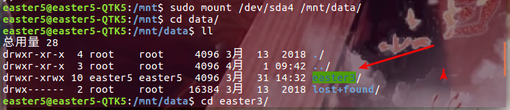
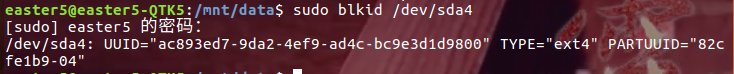

## 换源
桌面环境，采用图形界面换源：  
system settings > Software & Updates > Download from  
值改为阿里云源： http://mirrors.aliyun.com/ubuntu

命令行换源，参考[这个博客](http://blog.csdn.net/happywho250/article/details/52506321)


## unzip 解压中文乱码问题
> unzip 解压文件出现中文乱码现象，有一部分原因是因为文件是在 Windows 系统上用 GBK 压缩的，在 ubuntu 上用 UTF 解压时，中文就乱码了  
一种解决方法是在命令行解压时指定编码（使用 gnomo 解压管理器依然乱码），一种是安装其他解压软件（为了节省空间我用的第一种～）  

```bash
vim ~/.bashrc

# upzip add encode
alias unzip="unzip -O CP936"

source ~/.bashrc
```

## 开机无法自动挂载其他分区问题
> 我的硬盘是1T， 分给Ubuntu的启动分区是 20G ，去掉 windows 的 100G 分区，还有大概 600G 的闲置分区，  
一个很典型的问题是，链接到这个 600G 分区的快捷方式每次在重启后都会失效， idea 和 atom 开机后就会检测这个路径失效，需要重新打开这个目录（路径长了就很麻烦）  
所以我要做的就是让 ubuntu 开机就能挂载我的闲置分区。

#### 1. 查看当前分区情况
` sudo fdisk -l`  


根据磁盘给出的信息，确定想挂载的的磁盘（sda4），以及想挂载的位置（/mnt）  
所以现在我的目的就是把 **dev/sda4** 挂载到 **/mnt/data** 下。  
（/mnt/data 需要自己创建）  

#### 2. 创建挂载目录
 `sudo mkdir /mnt/data`  

#### 3. 开始挂载
`sudo mount /dev/sda4 /mnt/data/`  
  
挂载完成后进入到 `/mnt/data` 查看，验证我的 600G 已经挂载成功了  

#### 4. 设置开机自动挂载
挂载后重启进入到`/mnt/data`查看，已经是空目录了，所以还需要配置一下，实现开机自动挂载。  

##### 4.1 查询挂载硬盘 UUID  
`sudo blkid /dev/sda4`  


根据返回信息，得到 UUID 的值是**ac893ed7-9da2-4ef9-ad4c-bc9e3d1d9800**  
磁盘格式是 **ext4**

##### 4.2 将 UUID 添加到自动挂载目录中  
`sudo vim /etc/fstab`  

在文件末尾添加磁盘信息，按照下面格式：    
`[UUID=************] [挂载磁盘分区]  [挂载磁盘格式]  0  2 `   

`UUID=ac893ed7-9da2-4ef9-ad4c-bc9e3d1d9800 /mnt/data ext4 defaults 0 2`  

第一个数字：0表示开机不检查磁盘，1表示开机检查磁盘；   
第二个数字：0表示交换分区，1代表启动分区（Linux），2表示普通分区   
我的闲置分区是在安装Ubuntu时利用剩余空间创建的，磁盘格式为ext4  

【提示～】：  
挂载成功后，重启后原来的链接还是会失效～删除就可以，然后从 /mnt目录创建链接，这个链接是永久有效的～～

## 中文输入法（搜狗）
#### 1. 64位linux  
[http://10.182.80.11/cache/11/01/cdn2.ime.sogou.com/a1b78ad374f269e758526a230270991b/sogoupinyin_2.2.0.0102_amd64.deb?st=Yy10RkLzjGfU7wdVx33Wgw&e=1520948215&fn=sogoupinyin_2.2.0.0102_amd64.deb](http://10.182.80.11/cache/11/01/cdn2.ime.sogou.com/a1b78ad374f269e758526a230270991b/sogoupinyin_2.2.0.0102_amd64.deb?st=Yy10RkLzjGfU7wdVx33Wgw&e=1520948215&fn=sogoupinyin_2.2.0.0102_amd64.deb)  

#### 2. 安装
```bash
sudo dpkg -i sogoupinyin_2.2.0.0102_amd64.deb
sudo apt-get install -f
```

#### 3. 配置  
  - 配置System settings  
    进入System Settings > Language Support >  Keyboard input method system  
    将值改为**fcitx**  然后注销重启  

  - 在bash中打开 fcitx Configure
     Input Method 下添加`sogou Pinyin`


#### 4. 自定义短语设置
自定义简称，懒人福音  
设置/高级/自定义短语设置

我的配置文件
```markdown
sj,1=#$year-$month_mm-$day_dd-
```

可惜搜狗输入法linux下没有截屏插件~暂时用 shutter 代替
