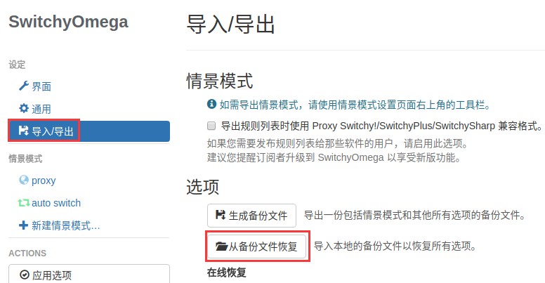
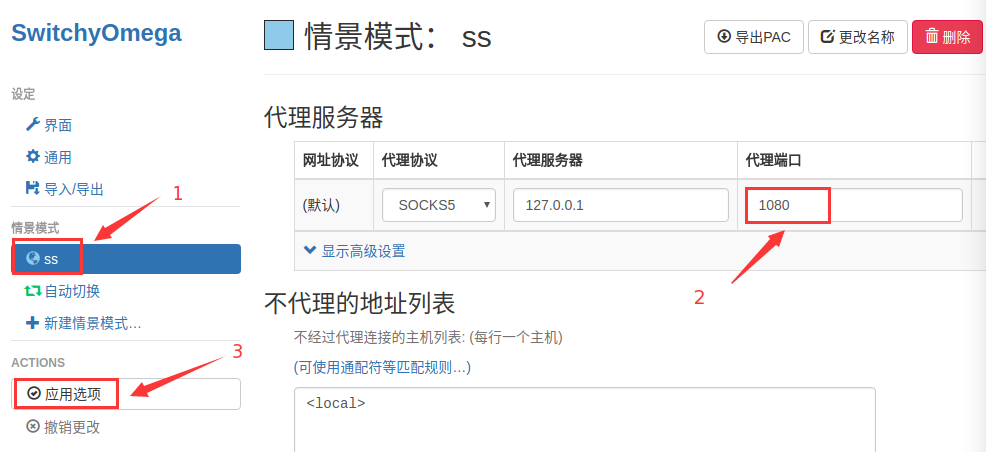

## 1.安装shandowsocks
```bash
sudo add-apt-repository ppa:hzwhuang/ss-qt5
sudo apt-get update
sudo apt-get install shadowsocks-qt5
```

## 2.下载Google
> 也可以链接到自己的仓库下载

对版本没有太高要求的话，在 [https://www.google.cn/chrome/](https://www.google.cn/chrome/)可下载（中国版？）

```bash
sudo wget https://repo.fdzh.org/chrome/google-chrome.list -P /etc/apt/sources.list.d/
wget -q -O - https://dl.google.com/linux/linux_signing_key.pub  | sudo apt-key add -
sudo apt-get update
sudo apt-get install google-chrome-stable
```

## 3. SwitchOMyGa
  - 从备份文件中下载插件和备份配置文件  
  - 安装插件  
  打开chrome浏览器，在浏览器地址栏输入“chrome://extensions/”，将刚下载的插件拖放进去，按提示操作即可完成安装。
  - 将浏览器配置脚本导入插件  
   
将端口改为“1080”，然后点“应用选项”  
   
在谷歌首页菜单点击插件选择“自动切换”，完成。

## 4. ss设为开机自启
- 在ubuntu software里搜索并安装“startup”
- 打开startup，将shadowsocks添加到开机启动项即可。

## 5. ss 代理终端
