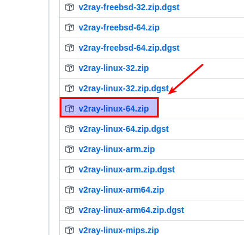
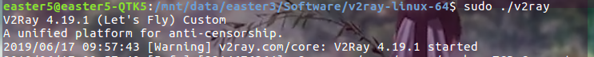
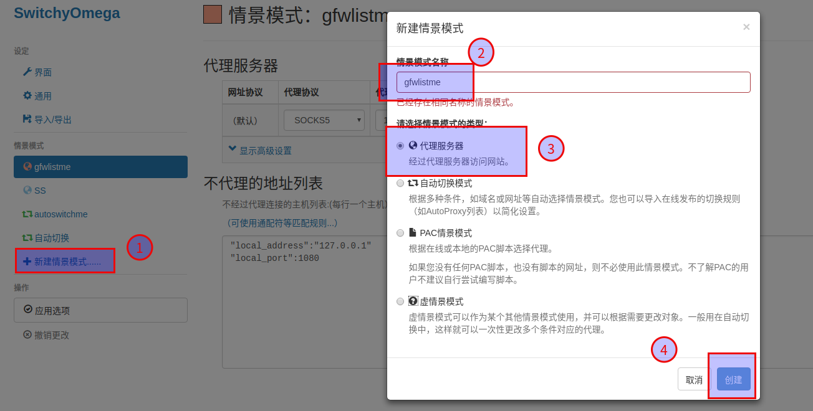
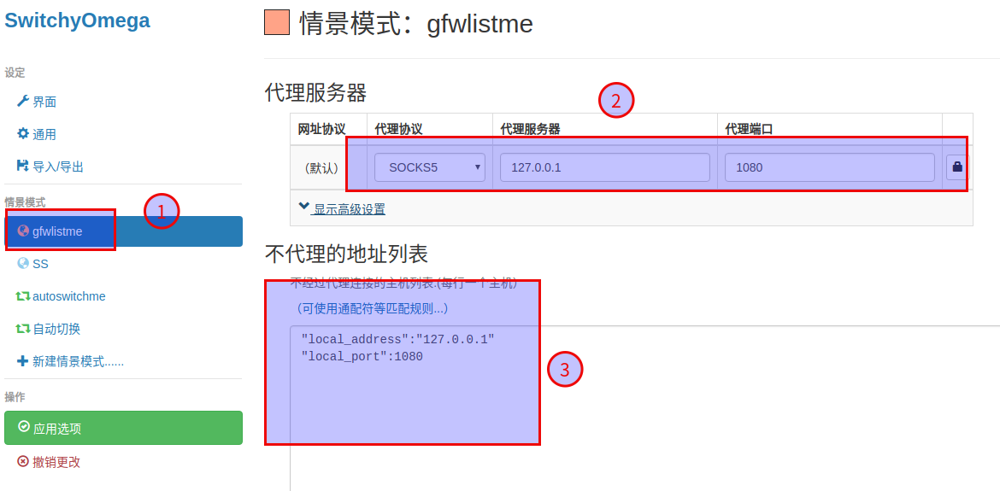
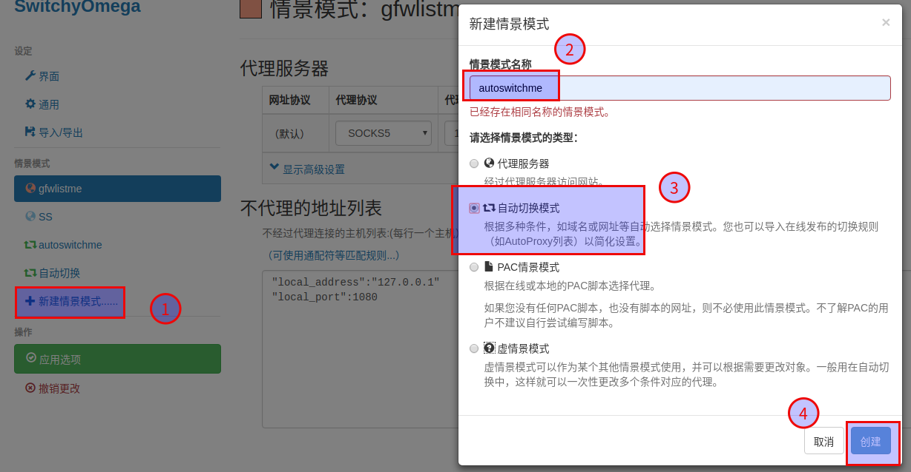
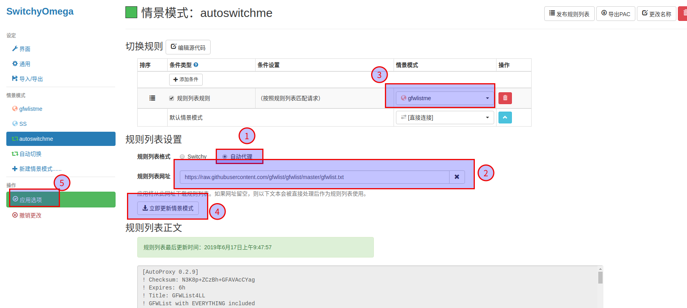

> v2ray 是一个优秀的开源的网络代理工具，在延时、速度和混淆能力上比ssr是青出于蓝，在ssr流量被精准勘测和识别，作者也停止维护的大背景下，v2ray 作为后起之秀是非常值得去了解和掌握的。从时间线上看，先有 ss，ss没落后，v2ray出现，v2ray相比ss功能更强大，最后 projectV 在 v2ray 的基础上发展成为一把构建各种网络环境的瑞士军刀，v2ray 是它的内核。  

> v2ray 项目至今（2019.06.16）一直稳定运行，覆盖了多个主流平台（windows、安卓、linux、macos），同时衍生了对应的 GUI（然而ubuntu就没有），放一个各平台的下载地址  

[v2ray各平台下载地址](https://github.com/v2ray/v2ray-core/releases)  

  
cpu是英特尔的一般下载箭头标识的，其他的下载arm架构的，一般都是英特尔～   
```bash
# 查看位数
getconf LONG_BIT
# 查看CPU型号
cat /proc/cpuinfo | grep name | cut -f2 -d: | uniq -c
```
> 推荐使用解压版，脚本安装虽然方便，卸载要一个个删除程序、配置文件、日志，卸载不完全解压版的也运行失败，推荐全局查找 `find / -name v2ray* `,逐个删除

# 零. 准备
我的系统是 Ubuntu 16.04 LTS，并且 v2ray 服务器端已经配置好（已经把 `config.json` 文件下载到本地），现在要做的是配置本地环境、配置浏览器代理两个部分。


# 一. 配置本地环境
解压生成 `v2ray-linux-64` 文件夹后，删除里面的`vpoint_vmess_freedom.json`，这是默认的配置文件，然后将服务端的`config.json`文件替换到这个文件夹中(v2ray与ss的一个不同就是前者没有客户端服务端之分，客户端和服务端共用一个配置文件`config.json`)。  

然后运行  
```bash
sudo ./v2ray
```

这样表示 v2ray 已经处于运行状态（但是还不能用）

# 二. 配置浏览器代理switchOmega
## 1. 新建代理模式


## 2. 设置代理端口
  
```bash
# 下面填这个（我设置的ss和v2ray都代理 1080端口，所以两者不能同时使用～）
"local_address":"127.0.0.1"
"local_port":1080
```

## 3. 新建自动切换模式


规则列表填这个：[https://raw.githubusercontent.com/gfwlist/gfwlist/master/gfwlist.txt](https://raw.githubusercontent.com/gfwlist/gfwlist/master/gfwlist.txt)  

然后打开浏览器，就可以正常上网了


# 三. 加个启动小图标
为了更方便的双击打开，做一个桌面项，  
v2ray.desktop  
```bash
[Desktop Entry]

Name=V2Ray

GenericName=V2Ray Client

Comment=double click to raise v2ray.
# 替换成自己的路径3处
Exec=/mnt/data/easter3/Software/v2ray-linux-64/v2ray --config=/mnt/data/easter3/Software/v2ray-linux-64/config.json

Icon=/mnt/data/easter3/Software/v2ray-linux-64/icon.jpeg
# 终端关闭即退出
Terminal=true

Type=Application

Categories=Network;Internet;
```
将文件勾选为**允许作为程序执行文件**，然后`sudo cp v2ray.desktop  /usr/share/applications`复制到 applications 目录下方便在程序列表中搜索，最后是这个样子：  

  

阔爱!!  O(∩_∩)O~~


# 四. 参考
- [ssr、v2ray、projectV 的联系与区别](https://www.zhuanyewanjia.com/news/180829163910548)
- [v2ray 官网](https://v2ray.com/)
