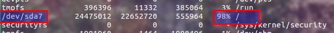
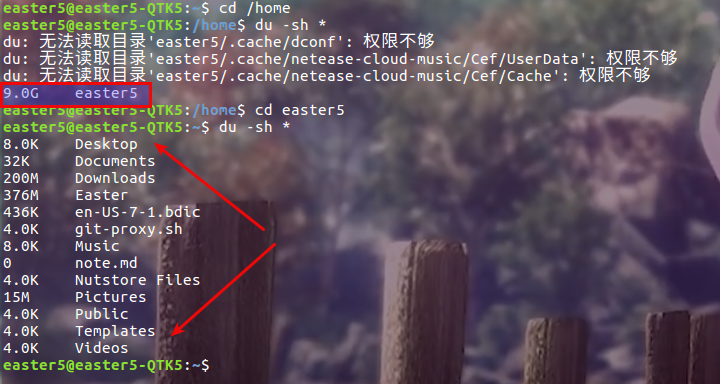
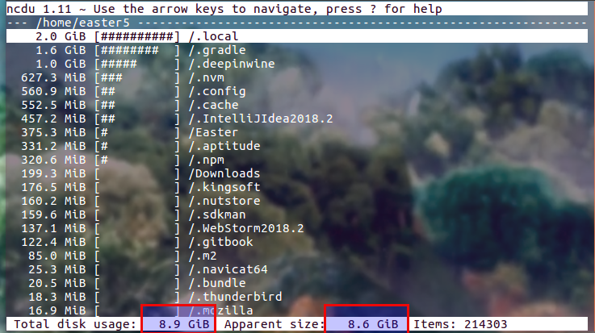
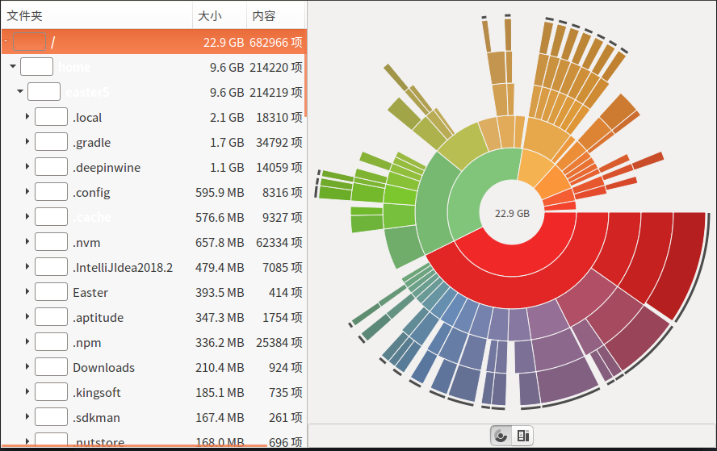
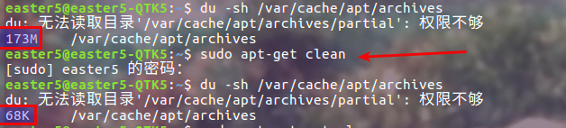
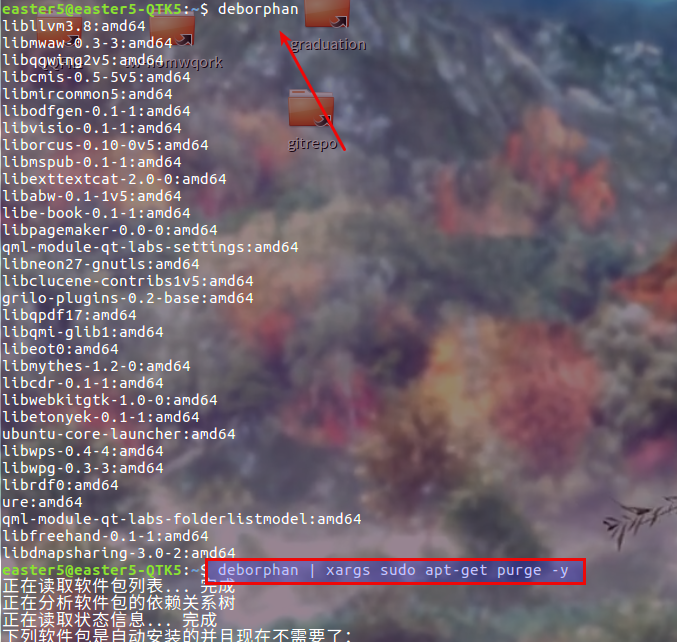
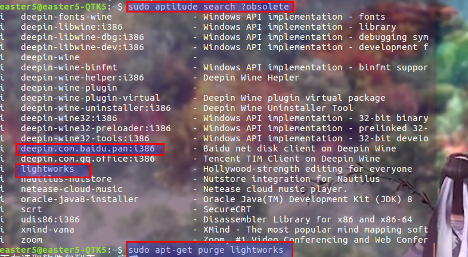
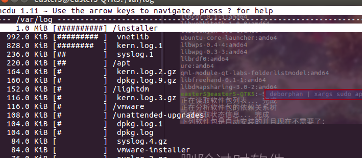
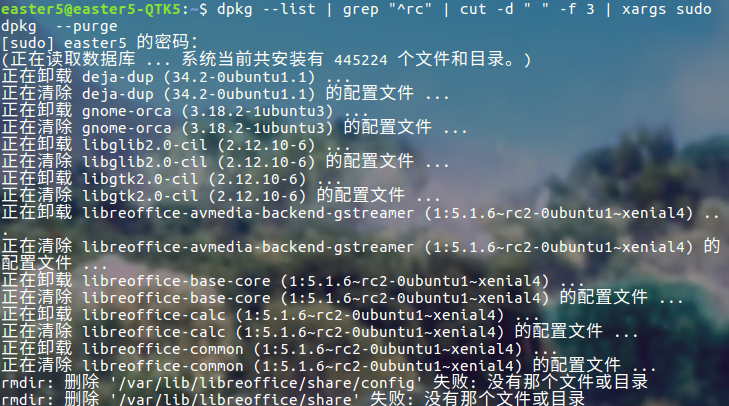
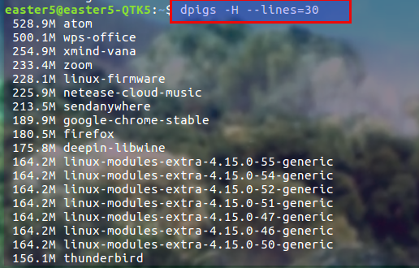

> 今天照常打开我的老年机，猝不及防的被弹了五六个问题报告弹窗，不出意外的，chrome点不动，网也连不上，dockey搜索失效，图形化软件统统打不开，我就知道大事不妙。。。


# 一. 开始
好在终端还能正常打开，结合我多年来丰富的被坑经验，3秒钟后我猜测是磁盘爆满卡机了。  

先查看整个系统磁盘使用情况
```bash
df -a
```


可见 `/` 目录占用达到 98%（实际上是100%,只是当时没法截图），然后查看根目录下有哪些大文件

```bash
cd /
du -sh *
```
最后找到是 `/home/easter5`占用空间  
奇怪的是进入到 `easter5` 下就找不到大文件了，本来怀疑是我挂载在`/home`目录下的磁盘空间也被计算到家目录下了，搞了一下午才发现是 `du`命令不能扫出隐藏文件，用`ncdu`就可以。。  


```bash
ncdu /home/easter5
```

总算找到了这些大文件，隐藏文件积累多了是多么要命//～

最简便的查看磁盘空间还是自带的`baobab`  


# 二. 断舍离操作

## 删除 deb 安装包
使用 `apt-get install` 安装的软件， apt-get 下载的 deb 安装包会保留在系统的 `/var/cache/apt/archives` 目录下  

```bash
# 查看安装包占用空间大小
du -sh /var/cache/apt/archives
# 删除安装包
sudo apt-get clean
```



## 删除孤儿软件包
用 apt-get 安装一个软件时，会自动安装其他的依赖，当这个软件被删除后，这些依赖就成了**孤儿软件包**，apt-get 安装的孤儿软件包可以通过
`sudo apt-get autoremove` 删除，而自己手动安装的依赖包（记得安装 vmware时候手动安装过依赖包）要用 `deborphan`删除。

```bash
# 删除 apt 安装的孤儿软件包
sudo apt-get autoremove

# 删除自己手动安装的孤儿软件包
sudo apt-get install deborphan

# 查看手动安装的孤儿软件包
deborphan

# 清理手动安装的孤儿
deborphan | xargs sudo apt-get purge -y
```




## 删除过时软件包
过时的软件包是指 `/etc/apt/sources.list`源文件中没有任何一个软件源提供这个软件的 deb 包，也就是说这个软件已经被软件源抛弃了，不再维护（过时的软件包尽量删除，因为不再更新后可能有安全隐患）

```bash
# 查看过时软件包
sudo aptitude search ?obsolete
# 手动单个删除
sudo apt-get purge [包名]
# 批量删除（不推荐）
sudo apt-get purge ~o
```  
注意软件源里找不到的未必都是过时的，比如 zoom 是从官网下载的deb安装，官网也没有提供软件源，但这个软件并不是过时的。



## 删除日志文件

```bash
# 简单粗暴删除
rm -rf /var/log/*

# 小心翼翼删除
sudo apt-get install ncdu
ncdu /var/log
sudo dd if=/dev/null of=/var/log/gpu-manager.log
```


## 删除残余配置文件
删除软件时，`apt-get remove [packageName]`只删除软件，不删除配置（方便重装），`apt-get purge [packageName]`删除软件和配置。r（Remove）c（Config）  

```bash
# 查看残余配置文件
dpkg --list | grep "^rc"
# 提取软件包名称
dpkg --list | grep "^rc" | cut -d " " -f 3
# 批量删除软件包
dpkg --list | grep "^rc" | cut -d " " -f 3 | xargs sudo dpkg  --purge
# 单个删除软件包
sudo dpkg --purge [packageName]
```


## 删除大容量软件包
```bash
# 安装 debian-goodies
sudo apt-get install debian-goodies
# 查看占用空间最大的前30个软件
dpigs -H --lines=30
```


# 三. 更简便的图形化清理工具
ubuntu-tweak 已经不再维护了，暂时还没有找到好的替代品QAQ～，占坑

# 四. 参考
- [https://www.linuxdashen.com/debianubuntu%E6%B8%85%E7%90%86%E7%A1%AC%E7%9B%98%E7%A9%BA%E9%97%B4%E7%9A%848%E4%B8%AA%E6%8A%80%E5%B7%A7](https://www.linuxdashen.com/debianubuntu%E6%B8%85%E7%90%86%E7%A1%AC%E7%9B%98%E7%A9%BA%E9%97%B4%E7%9A%848%E4%B8%AA%E6%8A%80%E5%B7%A7)
