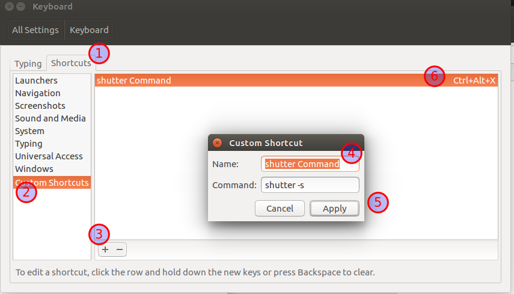

# peek
peek 用于录屏成gif/MP4 进行展示, [github地址](https://github.com/phw/peek)
（虽然linux版本一直停留在0.75，但完全够我用）

简单安装:  
```bash
sudo add-apt-repository ppa:peek-developers/stable
sudo apt update && sudo apt install peek
```

原始安装:  
```bash
sudo apt-get update
wget https://github.com/phw/peek/releases/download/v0.8.0/peek-0.8.0-Linux.deb
sudo apt install libsdl1.2debian ffmpeg libavdevice-ffmpeg56
sudo dpkg -i peek-0.8.0-Linux.deb
sudo apt-get -f install
```

# shutter
shutter 用于截图编辑加序号（标注功能很赞，但就是启动有些耗时QAQ）
```bash
sudo apt-get install shutter
```
配置截图快捷键:  

system settings --> Keyboard --> Shortcuts ---> Custom Shortcuts

   


# autojump
> 快速的文件导航小工具，基本上 1 秒打开我想找的任何文件

#### 安装

```java
// 安装
sudo apt install autojump
// 配置 bash
vim ~/.bashrc
. /usr/share/autojump/autojump.sh

// 查看更详细的信息
cat /usr/share/doc/autojump/README.Debian
```

#### 常用命令
```java
// 查看目录权重
j -s

// 使用文件管理器打开
jco 目录

// 定期从 atuojump 中清除已删除的目录
j --purge
```

# uGet - 下载

[uGet](http://ugetdm.com/) 是一款 Linux 下支持多点下载和断线续传的下载工具。

```bash
sudo apt update
sudo apt install aria2 uget
```

安装完成以后在 uGet 的设置选项中的Plugin面板开启aria2支持，这样能够在以后下载时使用多点下载功能。


# KeePass2
> KeePass2 和 1Password 我两个都在用，用来存储安全系数比较低的密码，1Password 在浏览器中用着更方便（时时清cookie）

PS：财务相关，个人身份信息相关的重要账号坚决不使用密码管理器，我很相信加密算法的安全性，但信息泄露最薄弱的环节是人，  
所有密码都用密码管理器托管，一旦泄露，就不是简单的裸奔了，简直是裸奔到手术台上等着别人解剖了，而且自己还不一定知道解剖是什么时候就已经开始的～  

密码管理器只用于托管不太重要的密码，重要密码，心算也是一个不错的办法。

## 安装
```bash
sudo apt-get update

sudo apt-get install keepass2
```
安装完成后添加中文翻译包（英文界面也挺好），到 [官网 - http://keepass.info/translations.html](http://keepass.info/translations.html) 下载 2.x 的中文包。  
然后将中文包解压到 keepass  
`sudo mv  Chinese_Simplified.lngx  /usr/lib/keepass2`  

最后启动 keepass2 ，在 view/Change Langugage 中选择Simplified Chinese  

## 中文乱码问题
菜单和对话框中文乱码，是因为 Ubuntu 默认字体族未映射中文字体。  

```bash
sudo vim /etc/fonts/conf.avail/65-nonlatin.conf

<alias>  
   <family>Ubuntu</family>  
   <prefer>  
      <family>sans-serif</family>  
   </prefer>  
</alias>
```


# ppa 图形化管理工具
> 方便的整理清除PPA源

```java
sudo add-apt-repository ppa:webupd8team/y-ppa-manager
sudo apt-get update
sudo apt-get install y-ppa-manager
```
