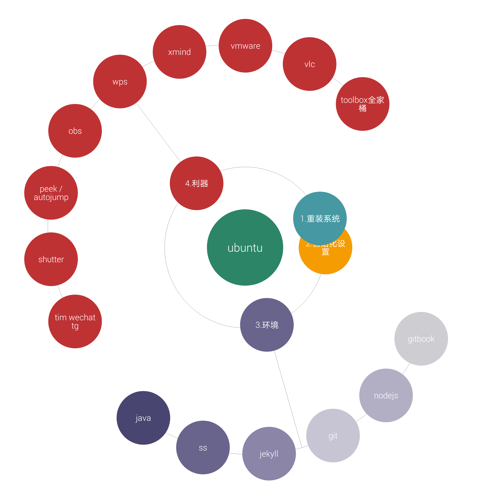

# 写在前面

每次装完系统，一夜回到解放前，各种软件环境重头装，装系统的日子是不会到头的，然后用了几天时间重新复盘现在的环境，
累死我惹

### TODO

- [ ] 添加在线编辑功能
- [ ] 换个肤，加个背景之类的
- [ ] bgm ？ 随机播放的那种
- [ ] 写一个setup脚本，一键安装所有软件
- [ ] 支持小表情图标 ？
- [ ] 网页计数器（卜蒜子或重新生成时记录不会被清空）
- [ ] 分享到QQ 微信 ？？好像没太大必要。。
